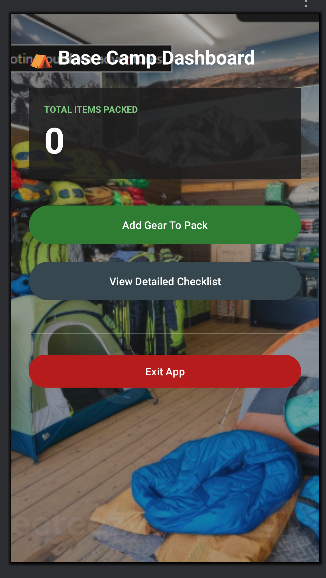
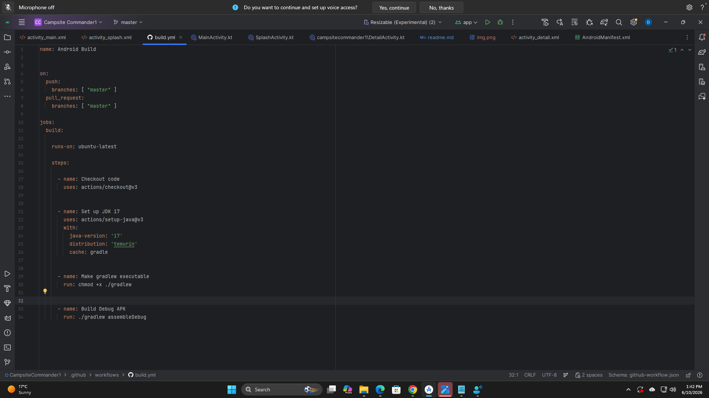

# Campsite Commander
**Name:** Donald Prosper Mudzani
**Student Number:** ST10512213
**GitHub Repository:**

## What Is This App?
So basically Campsite Commander is a gear and supply tracker 
The idea is that you're
part of a team building an inventory app for outdoor adventures.
The app lets you log camping items - name, category, quantity,
and any special notes - and then shows you the total number
of items you've packed. There's also a detailed checklist
screen so you can see everything laid out properly.
---
## How the App Works
1. The Splash Screen opens with a campfire logo and transitions
   to the Main Screen automatically after 3 seconds.
2. On the Main Screen you can see the total items packed and
   use the Add Gear button to log new equipment.
3. Clicking View Detailed Checklist opens a scrollable list
   of every item with its category, quantity, and notes.
4. The Back to Base button returns you to the main screen.
5. Exit App closes everything.
---
## Design Choices
Parallel arrays - each index position maps to the same item
across all four lists (Kotlin Documentation, 2024). So
itemNames[0], itemCategories[0], itemQuantities[0] and
itemComments[0] all refer to the Tent entry.
Loop-based total - I used a for loop inside a standalone
function instead of just calling .sum() because the brief
specifically asks for a loop implementation. It also makes
the logic easy to see and explain (Android Developers, 2024a).
---

### Total Items Calculation
FUNCTION calculateTotalPackedItems(quantities):
SET total = 0
FOR i FROM 0 TO quantities.size - 1:
total = total + quantities[i]
END FOR
RETURN total
END FUNCTION
### Input Validation
WHEN user presses Save To Pack:
IF name is empty OR category is empty OR qty is empty THEN
show Toast: "Please fill in Name, Category, and Quantity"
RETURN (do not save)
END IF
TRY
qty = convert qty string to Int
IF qty <= 0 THEN
show Toast: "Quantity must be 1 or more"
RETURN
END IF
ADD to all four parallel arrays at same index
CALL updateTotalDisplay()
CATCH NumberFormatException
show Toast: "Quantity must be a whole number"
END TRY
---
## Screenshots
[img.png](img.png)] - Campfire logo, app title, developer name,
student number. Auto-transitions after 3s.
[] -  dashboard with total count card,
Add Gear and View Checklist buttons.
[] - git hub actions.
---
## GitHub Usage
 I made sure
each message actually describes what changed (GitHub, 2024).
---
## GitHub Actions
The workflow at .github/workflows/build.yml runs automatically

on every push. It sets up Java 17 and runs ./gradlew assembleDebug
on a clean Ubuntu machine. Green tick means the code compiled
successfully (Android Developers, 2024b).
---
## References
Android Developers. 2024a. Intents and intent filters.
[online] Available at:
<https://developer.android.com/guide/components/intents-filters>
[Accessed 10 June 2026].
Android Developers. 2024b. Build your app from the command line.
[online] Available at:
<https://developer.android.com/build/building-cmdline>
[Accessed 10 June 2026].
GitHub. 2024. About commits. [online] Available at:

[Accessed 10 June 2026].
Kotlin Documentation. 2024. Collections overview. [online]
Available at: <https://kotlinlang.org/docs/collections-overview.html>
[Accessed 10 June 2026].